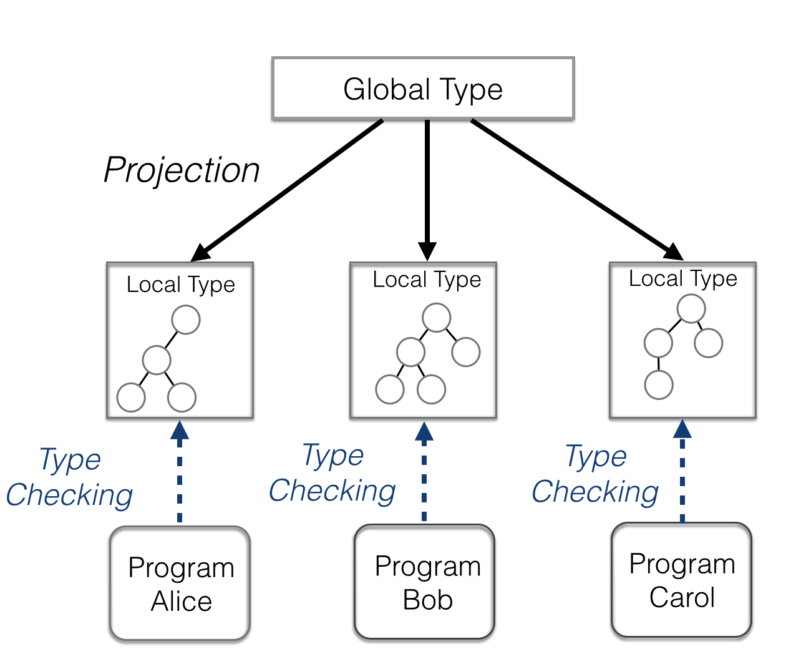
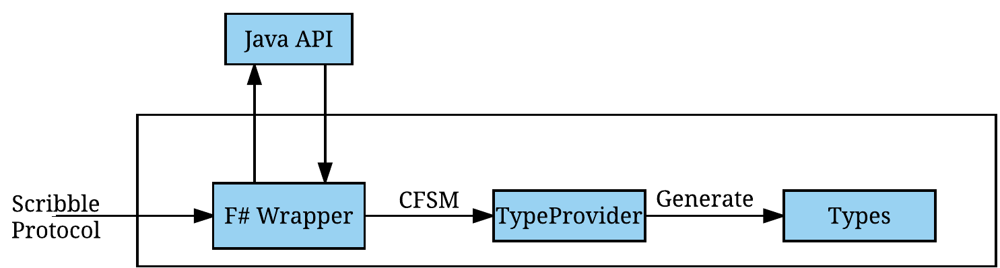

- title : Session#
- description : Session types for .Net
- author : Fahd Abdeljallal
- theme : sky
- transition : default

## Session types for F#

> **By** Fahd Abdeljallal

***

### Table of Contents

* [Motivation](#motivation)
* [What are Session Types?](#session)
* [Scribble: A language to describe application-level protocols](#scribble)
* [Session#: A Generative Type Provider](#session2)
* [Demo](#demo)
* [In Depth](#depth)

***

### Motivation 

* Codify the structure of communication
* Avoid communication errors such as deadlocks, communication mismatches 
* Provide type-safe way of communicating regarding a network protocol.

***

    <ul>
    <li>The adoption of session types in
         mainstream programming languages is challenging </li>     
    <li> Disadvantages of code generation </li>
        <ul>
        <li> Maintanability </li>     
        <li> Increases the overall project size and complexity </li>     
        <li> The generated types can be easily tempered </li>     
        </ul>     
    </ul>

---

### Background -- Type Provider 

    type Test = JsonProvider<""" { "name" : "Fahd" ,"age" : "22" } """>
    let test = Test.Parse(""" { "name" : "Khalissa" , "age" : "1" } """)
    let age = test.Age // -> 1
    let name = test.Name // -> Khalissa

* Compiler extension
* Generate types into the compiler instead of providing them in the source code
* Provides types ***On-Demand***
* Using Meta-information as a schema

***
### Example 

* Fibonacci 
    * Client - Server interaction/conversation
    * Client 
        * sends 2 Values = **U**_n_ and **U**_n+1_
        * finishes _conversation_
    * Server 
        * receives 2 Values and adds them ***OR*** the conversation 
        * sends the result

***

### Session types 

* Formalism to describe protocol
* 2 Kinds: 
    * Binary
    * Multiparty
* Global Type

<blockquote>

1 : C &#x2192; S :  c{&mu;<strong>t</strong>.fib &#60; int,int &#62; 
: S &#x2192; C : fib &#60; int &#62;.<strong>t</strong>  
bye &#60; &#62; .end }

</blockquote>

---

### Session types 

***

### Session types

<ul>
<li>
Local Type = projection over a local role
<li>
 &#8660; <strong> CFSM </strong> 
 </li>
</li>
<li> <strong> Duality </strong> </li>
</ul>

***

### Scribble 

* Language to describe application-level protocols
* Based on session types Formalism
* Verify (Well-formedness)
* Project (Global-type *to* Local-type ) 

    [lang=yaml]
    module demo;

    type <fsharp> "System.Int32" from "Location" as Int;

    global protocol Fibonacci(role A, role B){
        rec Fib {
            choice at A {
                fib(Int,Int) from A to B;
                fib(Int) from B to A;
                continue Fib;
            } or {
                bye() from A to B;
            }
        }
    }

***

### Local Type via Projection

    [lang=yaml]
    local protocol Fibonacci_A at A(A, B) {
        rec Fib {
            choice at A{
                fib(Int, Int) to B;
                fib(Int) from B;
                continue Fib;
            } or {
                bye() to B;
            }
        }
    }

---
    [lang=yaml]
    local protocol Fibonacci_B at B(A, B) {
        rec Fib {
            choice at A{
                fib(Int, Int) from A;
                fib(Int) to A;
                continue Fib;
            } or {
                bye() from A;
            }
        }
    }

***

***

### Session types primitives - Send and Receive 
    

    [lang=yaml]
    fib(Int) from B to A;

     <ul>
        <li> Implementation for B </li>
    </ul>

    let c = new Provided.TypeProviderFile<"Scribble.scr",protocol,"B">() 
    
    let n = 5                            
    c.sendfib(A,n)

    <ul>
        <li> Implementation for A </li>
    </ul>

    
    let c = new Provided.TypeProviderFile<"Scribble.scr",protocol,"A">()
    
    let buf = new DomainModel.Buf<int>()       
    c.receivefib(B,buf)

***

### Session types primitives -- Selection

    [lang=yaml]
    choice at A {
        fib(Int,Int) from A to B;
        ...
    } or {
         bye() from A to B;
    }

Implementation for A

    let n = 5 , let m = 8
    match value with
        |0 -> c.sendbye(B)
        |n -> c.sendfib(B,n,m)

***

### Session types primitives -- Branching

    [lang=yaml]
    choice at A {
        fib(Int,Int) from A to B;
        ...
    } or {
         bye() from A to B;
    }

Implementation for B

    let buf1,buf2 = new DomainModel.Buf<int>()

    match c.branch() with
        | :? ByeChoice as bye -> bye.receive(A)
        | :? FibChoice as fib -> fib.receive(A,buf1,buf2)

***

### IntelliSense

***

### General Architecture 

***

### Demo-time 

***

### Generative Type Provider 

***

### Communication Architecture 

***

### Communication Architecture 

    type MessageAction =
        |SendMessage of byte [] * string 
        |ReceiveMessage of byte[] list * string * string list * AsyncReplyChannel<byte [] list> 
        |ReceiveMessageAsync of byte[] list * string * string list * AsyncReplyChannel<byte [] list>
    
---
### Multi-Stage Programming

***

### Conclusion 

* An F# Library for :
    * Distributed programming
    * On-demand static generation types
    * Supporting Asynchronous + Synchronous operations
    * Basic session types operators
    * ***.NET*** Types

***

### Future Work 

* Linearity at Compile-time

    let x = new A_Channel()
    let a = x.doSomething()
    //let b = x.doSomething()

* Add support for Multi-thread programming
* Improve support for branching with lambdas or Discriminated Unions

***

### Question

    type Question = TypeProvider<""" "Ask": "A question" """>
    let question = Question.Parse(""" "Ask" : "Session types rock" """)
    let response = question.Ask
***